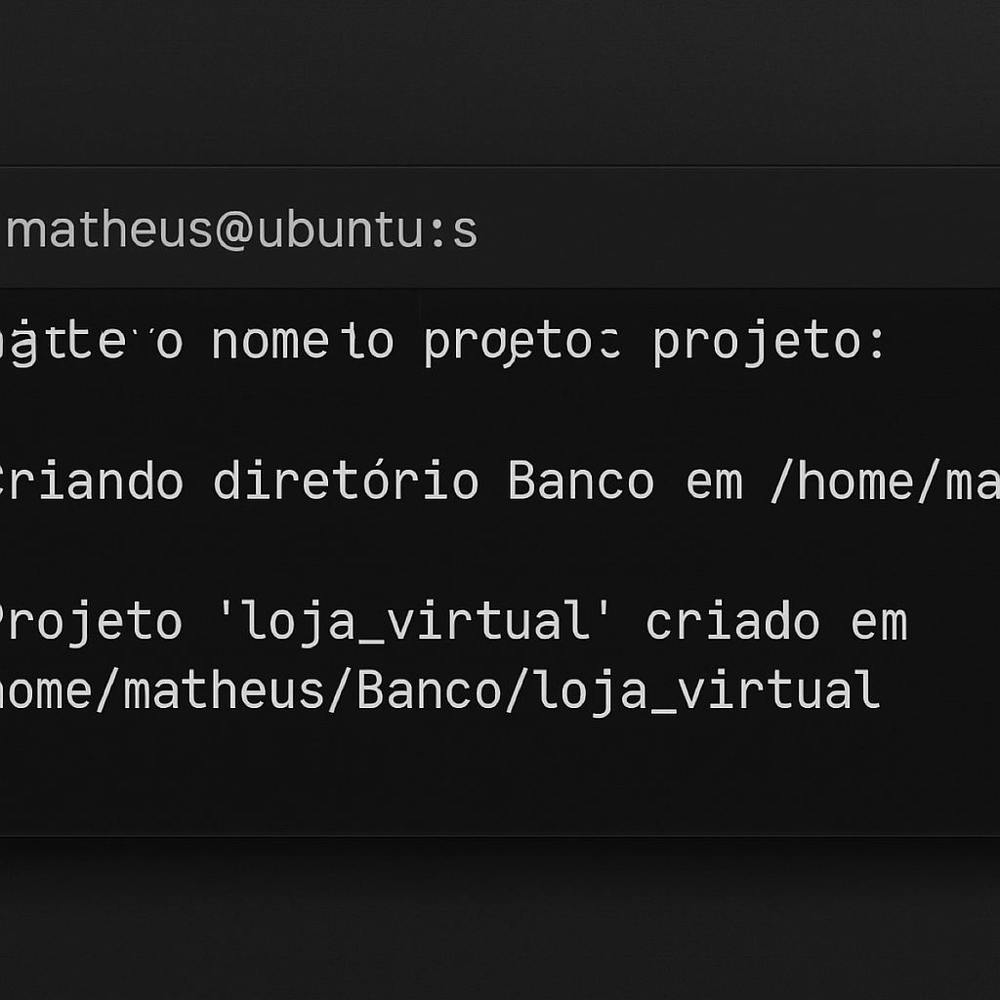

# 🛠️ Script de Criação de Projetos de Banco

Este script em **Bash** automatiza a criação de uma estrutura de diretórios e arquivos base para projetos relacionados a bancos de dados.  
Ele organiza a estrutura em pastas padrão, gera arquivos iniciais (`README.md`, `.gitignore`, `master.sql`) e prepara o ambiente de forma rápida.

---

## 🚀 Funcionalidades

- Solicita ao usuário o **nome do projeto**
- Cria a pasta `Banco` na **home do usuário** (se ainda não existir).
- Gera uma estrutura organizada de diretórios:
  - `migrations/` → Scripts de criação e alteração do banco.    
  - `seeds/` → Dados iniciais para popular o banco.  
  - `procedures/` → Procedures do banco de dados.  
  - `triggers/` → Triggers do banco de dados.  
  - `views/` → Views do banco de dados.
- Cria automaticamente:
  - Um `README.md` inicial com o nome e data do projeto.  
  - Um `.gitignore` com regras básicas.  
  - Um script `master.sql` dentro de `migrations/` para criação do banco.  
  - Um arquivo vazio `dados.sql` em `seeds/`.

---

### Considerações Finais

Baixe o script e execute no terminal (linux ou MacOs):

bash run.sh no diretório da pasta do script.